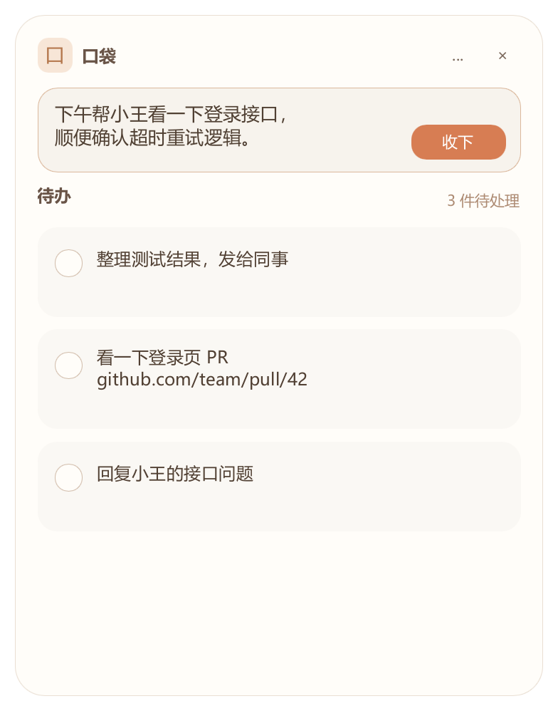

# 口袋宠物 · Pocket Pet

一个帮你记住“等会儿要做”的 Windows 桌面小猫。

编程、开会或处理多个任务时，先把要回复的问题、截图和临时事项收下，忙完再回来处理。目标是快速记录、少打断，不把临时备忘变成复杂的任务管理流程。

**当前状态：Alpha 原型。** 主要开发版本使用 Rust + Slint，不使用 WebView。维护者反馈最新版本标题栏显示正常，仍需覆盖不同显示环境；本阶段先发布源码，不提供稳定版安装包。详见 [已知问题](docs/KNOWN_ISSUES.md)。

[](https://slint.dev)

## 界面演示



[查看完整示例图示](docs/DEMO.md)，或下载源码后打开 docs/demo.html 浏览演示。图片仅使用内置示例数据。

## 能做什么

- **随手记录**：点击小猫打开统一面板，顶部输入，下方查看待办；支持文字、截图和文件附件。
- **轻量速览**：悬停小猫，侧边浮出待办卡片；滚轮翻阅，点击正文进入完整面板。
- **安静的数量提示**：右上角仅显示数字，零待办隐藏，超过 99 显示 `99+`。
- **快捷收下**：Ctrl+V 粘贴（含 PixPin 位图兼容处理）；拖到小猫上收下；Ctrl+Alt+V 直接收下剪贴板。
- **完成与撤销**：完成时播放像素消散，提供 6 秒撤销；显示记录加入时间。
- **轻提醒**：按需设置提醒；长时间未查看待办时轻提示，不自动打开面板。

资源占用是设计目标，目前没有可复现的性能基准，不承诺固定内存占用。

## 从源码运行

需要 Windows、Rust **1.92 或更新版本**（当前 Slint 依赖要求），以及 MSVC 链接器。建议通过 rustup 安装 Rust，并在 Visual Studio Build Tools 中安装“使用 C++ 的桌面开发”和 Windows SDK。

从仓库根目录执行，首次构建需要下载依赖：

```powershell
cargo build --release --locked --manifest-path slint-preview/Cargo.toml
.\slint-preview\target\release\pocket-pet-slint.exe
```

启动后显示小猫和系统托盘图标，不占任务栏；也可双击已构建的 exe。再次启动会唤回已有实例，不重复注册快捷键。托盘图标可能收在时钟旁的 ^ 中。

| 操作 | 结果 |
| --- | --- |
| 悬停小猫 | 延迟显示侧边速览，移出后收起 |
| 点击小猫或数字 | 打开/收起完整记录面板 |
| 拖动小猫 | 移动位置 |
| Enter / Shift+Enter | 收下 / 换行 |
| Ctrl+V | 在输入区粘贴文字或截图 |
| Ctrl+Alt+V | 全局收下剪贴板，不改变输入草稿 |
| 拖入文字、图片或本地文件 | 保存一条记录和附件副本 |
| Esc、关闭或切换其他窗口 | 收起面板并保留草稿 |

托盘左键找回小猫，右键可显示/隐藏、记一条、切换置顶、设置开机启动或退出。置顶默认开启并记忆选择，统一作用于三个窗口；开机启动默认关闭。隐藏期间暂停桌面提示，恢复后可查看到期事项。退出也可使用完整面板右上角菜单。更多操作见 [Slint 版说明](slint-preview/README.md)。

## 数据在哪里

正式数据保存在 `%LOCALAPPDATA%\PocketPetSlintPreview`，包括 `state.json`、备份、`preferences.json`、`images/` 和 `files/`。`preferences.json` 会记住置顶和已完成列表的展开状态。备份时复制整个目录。撤销或移除记录引用不会立即删除附件文件。

`--snapshot` 使用独立的 `slint-preview/preview-output/` 示例数据目录。构建产物、测试输出、诊断日志和本地数据不应上传 GitHub；分享截图和日志前请自行检查其中的私人信息。

## 开发与验证

先退出应用，确保 Ctrl+Alt+V 未被占用：

```powershell
cargo test --locked --manifest-path slint-preview/Cargo.toml
cargo build --release --locked --manifest-path slint-preview/Cargo.toml
.\slint-preview\target\release\pocket-pet-slint.exe --snapshot
```

预览模式会短暂打开窗口，生成截图和 `*-check.txt`，然后退出。请检查结果文件中的 PASS/FAIL；进程退出成功不代表所有检查通过。快照和窗口可见标志也不能替代真实桌面上的显示、焦点与多屏验证。

## 仓库导航

| 路径 | 用途 |
| --- | --- |
| [slint-preview/](slint-preview/README.md) | 当前开发版本，独立 Cargo 项目 |
| [src/](src/) | 早期 Rust/Win32 原型，保留作对照 |
| [docs/NATIVE.md](docs/NATIVE.md) | 原生原型运行说明 |
| [docs/ARCHITECTURE.md](docs/ARCHITECTURE.md) | 窗口、模块和数据流程 |
| [docs/ROADMAP.md](docs/ROADMAP.md) | 已实现功能与后续优先级 |
| [docs/KNOWN_ISSUES.md](docs/KNOWN_ISSUES.md) | 已知问题与验证边界 |
| [CONTRIBUTING.md](CONTRIBUTING.md) | 开发和问题反馈约定 |
| [docs/LICENSING.md](docs/LICENSING.md) | MIT 许可、Slint 署名与素材来源 |

根目录直接运行 `cargo` 会构建原生原型，而不是 Slint 版。两版数据目录独立，不自动迁移。

## 许可状态

本项目自有代码、文档和 SVG 素材采用 [MIT License](LICENSE)。Slint 依照其免版税桌面应用许可使用，第三方依赖保留各自许可；详见 [许可与素材说明](docs/LICENSING.md)。
