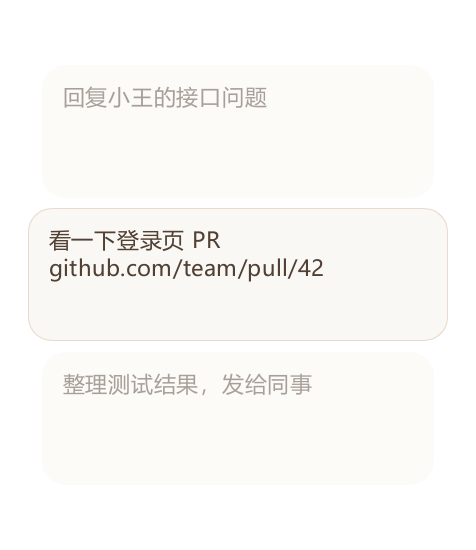
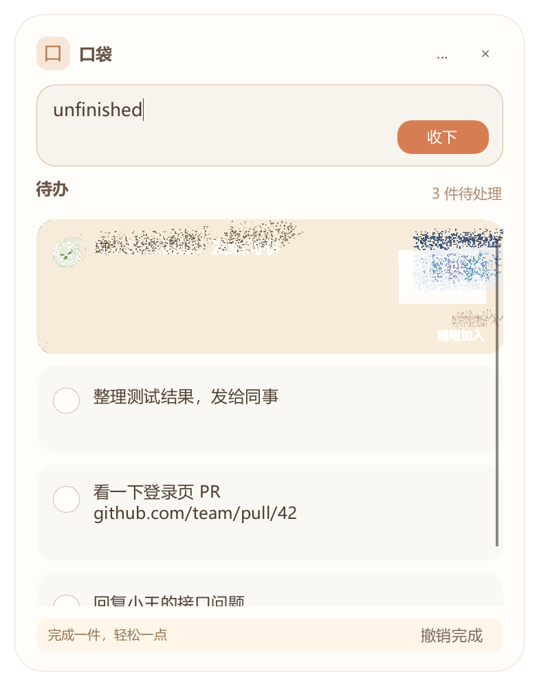

# 示例演示

以下图片来自隔离预览模式的内置示例数据，不读取正式个人数据目录。这是界面状态图示，不是连续桌面录屏，也不证明所有显示场景均已验证。

可在本地浏览器打开 [演示页](demo.html)，点击切换四个状态。

## 1. 小猫与数字角标

## 2. 快速记录与完整面板

## 3. 侧边速览

## 4. 完成反馈

图片由 --snapshot 使用示例数据生成。不要用真实个人数据截图覆盖公开演示素材。
